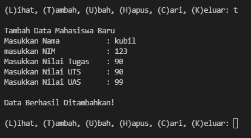

# **PERTEMUAN 10 (latihan 1)**
pada latihan 1 saya diberi soal sebagai berikut:

## JAWAB
>pertama

saya membuat data kontak awal
```py
b={'ari':'085267888','dina':'087677776'}
```
>kedua

saya diberi soal untuk menampilkan kontak ari
```py
print(b['ari'])
```

>ketiga

saya disuruh menambah kontak atas nama riko
```py
b['riko']='087654544'
```
>keempat

ubah kontak dina
```py
b['dina']='088999776'
```
>kelima

tampilkan semua nama
```py
print(b.keys())
```
>keenam

tampilkan semua nomor
```py
print(b.values())
```
>ketujuh

nenampilkan semua nama dan nomor
```py
print(b)
```

menghapus kontak dina
```py
del b['dina']
```

## tampilan pada visual studio code


## output


# PERTEMUAN 10 (TUGAS PRAKTIKUM)
pada tugas praktium saya diberi soal sebagai berikut
 
## flowchart

## JAWAB
pertama saya membuat looping agar program terus berjalan
```py
while True:
    c = input("\n(L)ihat, (T)ambah, (U)bah, (H)apus, (C)ari, (K)eluar: ")                                
```
lalu saya membuat format if untuk memasukan pilihan ,
sebagai contoh apabila memilih (t) akan menambah data
```py
if (c.lower() == 't'):                                               
        print('\nTambah Data Mahasiswa Baru')
        nama= input("Masukkan Nama\t\t: ")                                        
        nim= input("Masukkan NIM\t\t: ")                                         
        nilaiTugas= int(input("Masukkan Nilai Tugas\t: "))                              
        nilaiUts= int(input("Masukkan Nilai UTS\t: "))                                   
        nilaiUas= int(input("Masukkan Nilai UAS\t: "))                                    
        nilaiAkhir= (0.30 * nilaiTugas) + (0.35 * nilaiUts) + (0.35 * nilaiUas)              
        dataMhs[nama]= nim, nilaiTugas, nilaiUts, nilaiUas, nilaiAkhir                         
        print("\nData Berhasil Ditambahkan!")
```
saya juga melakukan percabangan if (elif) untuk melaksanakan pilihan yang lain
```py
elif (c.lower() == 'u'):                                                                    
        print('\nMengedit Data Mahasiswa')
        nama = input("Masukkan Nama: ")                                                         
        if nama in dataMhs.keys():                              
            nim= input("Masukkan NIM Baru\t: ")                              
            nilaiTugas= int(input("Masukkan Nilai Tugas\t: "))                           
            nilaiUts= int(input("Masukkan Nilai UTS\t: "))                           
            nilaiUas= int(input("Masukkan Nilai UAS\t: "))                           
            nilaiAkhir= (0.30 * nilaiTugas) + (0.35 * nilaiUts) + (0.35 * nilaiUas)          
            dataMhs[nama] = nim, nilaiTugas, nilaiUts, nilaiUas, nilaiAkhir                      
            print("\nData Berhasil Di Update!")
```
dan saya juga menggunakan else untuk apabila salah memasukan pilihan inputan 
```py
else:
        print("Pilih menu yang tersedia: ")                                                    
```
## tampilan pada visual studio code


## output
ini adalah output apabila memilih tambah(t)


ini adalah output apabila memilih ubah(u)


ini adalah output apabila memilih cari(c)


ini adalah output apabila memilih untuk  tambah lagi


ini adalah output apabila memilih hapus(h)


ini adalah output apabila memilih lihat (l)


ini adalah output apabila memilih keluar (k)


======TERIMAKASIH======
